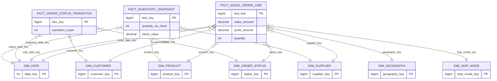

# Architecture technique - BI / Data Warehouse

## 1. Vue d'ensemble

La couche BI est construite comme un pipeline ETL Python qui consomme les APIs REST
de l'ERP backend, alimente un Data Warehouse PostgreSQL modélisé en **schéma étoile**,
et expose les résultats via des tableaux de bord interactifs (Dash/Plotly).

```
Backend ERP (OLTP)              BI (OLAP)
┌──────────────────┐           ┌────────────────────────────────────┐
│  Gateway :4000   │  REST/JWT │  run_pipeline.py                   │
│  ├─ Sales :4001  │◄──────────│  ├─ etl/extract.py                 │
│  ├─ Catalog :4002│           │  ├─ etl/transform.py               │
│  ├─ Customers    │           │  └─ etl/load.py                    │
│  └─ Suppliers    │           │                                    │
│                  │           │  PostgreSQL : erp_distribution_dwh  │
│  PostgreSQL      │           │  ├─ staging_raw.*                   │
│  erp_distribution│           │  ├─ staging_clean.*                 │
└──────────────────┘           │  └─ dwh.*  (étoile)                │
                               │                                    │
                               │  app.py (Dash :8050)               │
                               │  ├─ /           Pipeline ETL       │
                               │  ├─ /strategic  Dashboard stratég. │
                               │  ├─ /tactical   Dashboard tactique │
                               │  └─ /operational Dashboard opérat. │
                               └────────────────────────────────────┘
```

## 2. Principes de conception

- **Séparation OLTP / OLAP** : deux bases PostgreSQL distinctes, aucune lecture directe de la base ERP.
- **Extraction API-first** : toutes les données transitent par les APIs REST du gateway avec authentification JWT.
- **Idempotence** : chaque étape peut être rejouée sans effet de bord (TRUNCATE staging, ON CONFLICT facts).
- **Schéma étoile** : modélisation dimensionnelle classique (Kimball) avec dimensions SCD2-ready et tables de faits.
- **Pipeline unique** : un seul point d'entrée (`run_pipeline.py`) qui auto-bootstrap la base, le schéma et l'ETL.
- **Interface unifiée** : un serveur Dash (`app.py`) qui combine pilotage ETL et tableaux de bord.

## 3. Flux de données

### 3.1 Extract (API ERP → staging_raw)

1. Login gateway (`POST /api/v1/auth/login`) → token JWT
2. Appels paginés vers chaque service :
   - `GET /api/v1/customers` (service Customers)
   - `GET /api/v1/suppliers` (service Suppliers)
   - `GET /api/v1/catalog/products` (service Catalog)
   - `GET /api/v1/sales/orders` + `GET /api/v1/sales/orders/:id` (service Sales : commandes, lignes, historique statut)
3. Full-refresh `staging_raw.*` (TRUNCATE + INSERT)

### 3.2 Transform (staging_raw → staging_clean → dwh dimensions)

Phase 1 — Normalisation :
- `trim()` + `lower()` sur champs de comparaison (noms, emails)
- `DISTINCT ON ... ORDER BY updated_at DESC` pour déduplication par clé naturelle
- Full-refresh `staging_clean.*`

Phase 2 — Déduplication / qualité :
- Détection doublons clients (nom + email normalisés)
- Détection doublons produits (nom + fournisseur)
- Suppression commandes incohérentes (`ship_date < order_date`)

Phase 3 — Conformation dimensionnelle :
- Insertion Type-1 des nouvelles entités dans `dwh.dim_*`
- Population des dimensions de référence (statuts, modes livraison)
- Hash MD5 pour préparer la détection SCD2

### 3.3 Load (staging_clean + dwh dimensions → dwh faits)

- Génération `dim_date` depuis toutes les dates staging + `CURRENT_DATE`
- Génération `dim_geography` par hash (pays|region|etat|ville|code_postal)
- Chargement des 3 tables de faits avec résolution FK dimensionnelle et upsert idempotent

## 4. Modélisation dimensionnelle (schéma étoile)

### 4.1 Dimensions

| Dimension | Clé naturelle | SCD | Description |
|---|---|---|---|
| `dim_date` | `date_key` (YYYYMMDD) | — | Temporelle (jour, mois, trimestre, année, weekend) |
| `dim_geography` | `geography_hash` | — | Localisation (pays, region, etat, ville, code postal) |
| `dim_customer` | `customer_id` | Type 2 ready | Client (nom, segment, localisation, email) |
| `dim_supplier` | `supplier_id` | Type 2 ready | Fournisseur (nom, pays, rating, délai) |
| `dim_product` | `product_id` | Type 2 ready | Produit (nom, catégorie, coûts, fournisseur) |
| `dim_order_status` | `status_code` | — | Statuts de commande (Draft, Confirmed, Shipped...) |
| `dim_ship_mode` | `ship_mode_code` | — | Modes de livraison |

### 4.2 Faits

| Fait | Grain | Mesures | FK dimensions |
|---|---|---|---|
| `fact_sales_order_line` | 1 ligne de commande | quantity, discount_rate, sales_amount, unit_price_amount, cost_amount, profit_amount | date, ship_date, customer, product, supplier, geography, status, ship_mode |
| `fact_order_status_transition` | 1 changement de statut | transition_count | status_date, status, customer |
| `fact_inventory_snapshot` | 1 produit par jour | quantity_on_hand, stock_value | snapshot_date, product, supplier |

## 5. Choix technologiques

| Composant | Technologie | Justification |
|---|---|---|
| Pipeline ETL | Python 3.10+ | Écosystème data, simplicité, psycopg2 natif |
| DWH | PostgreSQL | Même moteur que l'OLTP, compétence déjà acquise, coût zéro |
| Extraction | urllib (stdlib) | Zéro dépendance externe pour les appels HTTP |
| Orchestration | `run_pipeline.py` | Script unique, pas de dépendance lourde (Airflow non nécessaire à ce stade) |

## 6. Décisions d'architecture importantes

- Les dimensions SCD2 sont **prêtes** (valid_from, valid_to, is_current, hash) mais la logique de versionning n'est pas encore activée (Type-1 insert pour l'instant). Évolutif sans changer le schéma.
- `fact_inventory_snapshot` utilise `CURRENT_DATE` comme clé de date pour constituer un historique de stock au fil des runs.
- Les upserts (`ON CONFLICT ... DO UPDATE`) garantissent que le pipeline peut être relancé sans dupliquer les données.
- Chaque ligne ETL porte un `etl_run_id` pour traçabilité.

## 7. Diagramme : schéma étoile



## 8. Interface OLAP (`interface_olap/`)

L'interface graphique est une application JavaScript séparée (Express + vanilla JS + Chart.js),
accessible sur `http://localhost:3030`.

### 8.1 Architecture

```
interface_olap/
├── server.js              Express (API JSON + fichiers statiques)
├── db.js                  Pool PostgreSQL (pg)
├── routes/
│   ├── dashboard.js       GET /api/dashboard/{strategic,tactical,operational}
│   └── pipeline.js        POST /api/pipeline/run  |  GET /api/pipeline/status
└── public/
    ├── index.html          SPA shell
    ├── css/style.css       Styles modernes (sidebar, cards, grids)
    └── js/
        ├── app.js          Routeur SPA (hash-based)
        ├── api.js          Client fetch
        ├── charts.js       Wrappers Chart.js
        └── pages/          pipeline.js, strategic.js, tactical.js, operational.js
```

- **Pas de build step** : tout est servi en fichiers statiques.
- **Séparation API / UI** : le serveur Express expose des endpoints JSON, le frontend les consomme.
- **Chart.js 4** pour tous les graphiques (line, bar, doughnut, area).

### 8.2 Pages

| Route | Dashboard | Public cible | Contenu principal |
|---|---|---|---|
| `#/` | Pipeline ETL | Administrateur | Boutons lancer ETL (normal + force), logs temps réel |
| `#/strategic` | Stratégique | Direction | KPIs, CA mensuel, segments, géo, top produits |
| `#/tactical` | Tactique | Managers | Tendance quotidienne, catégories, statuts, modes livraison |
| `#/operational` | Opérationnel | Équipes | Commandes récentes, alertes stock, transitions, géo |

## 9. Détection de changement (ETL incrémental)

Le pipeline ETL intègre une logique de **détection de changement** pour éviter des
rechargements inutiles quand les données source n'ont pas évolué.

### Mécanisme

1. Après extraction des données API, un **checksum MD5** est calculé pour chaque entité
   (customers, suppliers, products, orders, order_lines, order_status_history).
2. Les checksums sont comparés avec ceux de la dernière exécution (fichier `.etl_checksums.json`).
3. Si **tous les checksums sont identiques** → Transform + Load sont ignorés.
4. Si **au moins un checksum diffère** → pipeline complet.
5. `--force` permet de forcer le rechargement même sans changement.

### Rapport CLI

À la fin du pipeline (qu'il y ait eu changement ou non), un **rapport BI textuel** est affiché :
KPIs globaux, tendances mensuelles, segments, top produits, top clients, alertes stock, volumes DWH.
