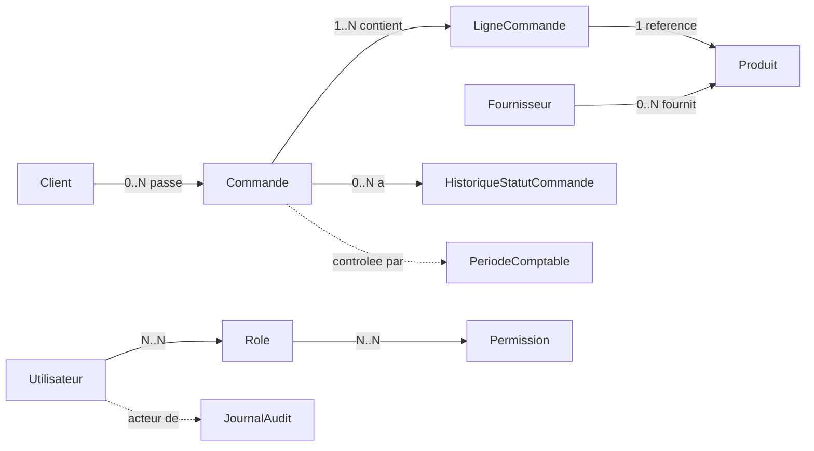
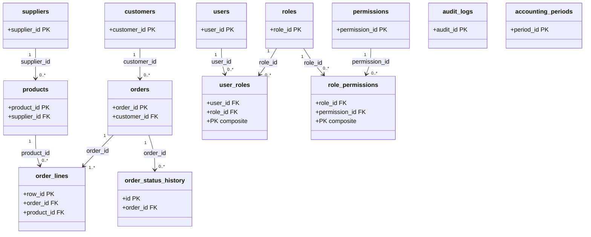
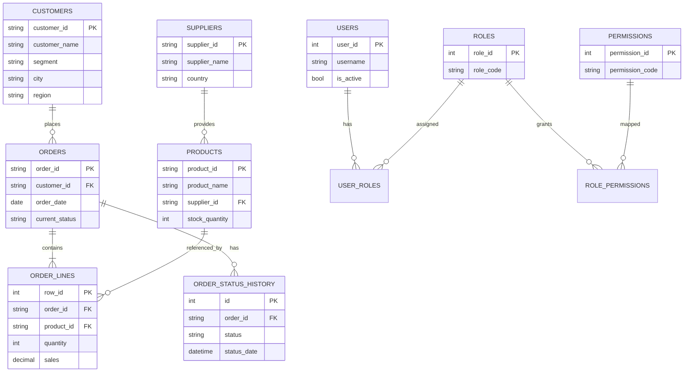

# Modèle de données (MCD / MLD / ERD)

## 1. MCD (conceptuel)

## 2. MLD (relationnel simplifié)

## 3. ERD (Mermaid)

## 4. Contraintes clés

- `orders_ship_date_after_order_date_check`
- `suppliers_rating_range_check` (rating entre 0 et 5)
- `suppliers_lead_time_non_negative_check` (lead_time_days >= 0)
- `products_non_negative_values_check` (unit_cost, unit_price, stock/reorder >= 0)
- `order_lines_business_values_check` (quantity > 0, discount 0..1, montants >= 0)
- `status` des périodes comptables limité à `open|closed`
- suppression cascade `orders -> order_lines` et `orders -> order_status_history`
- clés uniques sur `username`, `role_code`, `permission_code`

## 5. Note API / FK

La base conserve les FK en ID.
L'API peut accepter des noms (supplier/customer/product), puis résout vers ID avant persistance.
