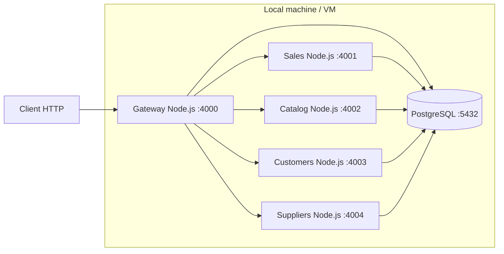

# Deployment View

Variables environnementales principales:
- `GATEWAY_PORT`, `SALES_SERVICE_PORT`, `CATALOG_SERVICE_PORT`, `CUSTOMERS_SERVICE_PORT`, `SUPPLIERS_SERVICE_PORT`
- `PGHOST`, `PGPORT`, `PGDATABASE`, `PGUSER`, `PGPASSWORD`
- `GATEWAY_JWT_SECRET`
