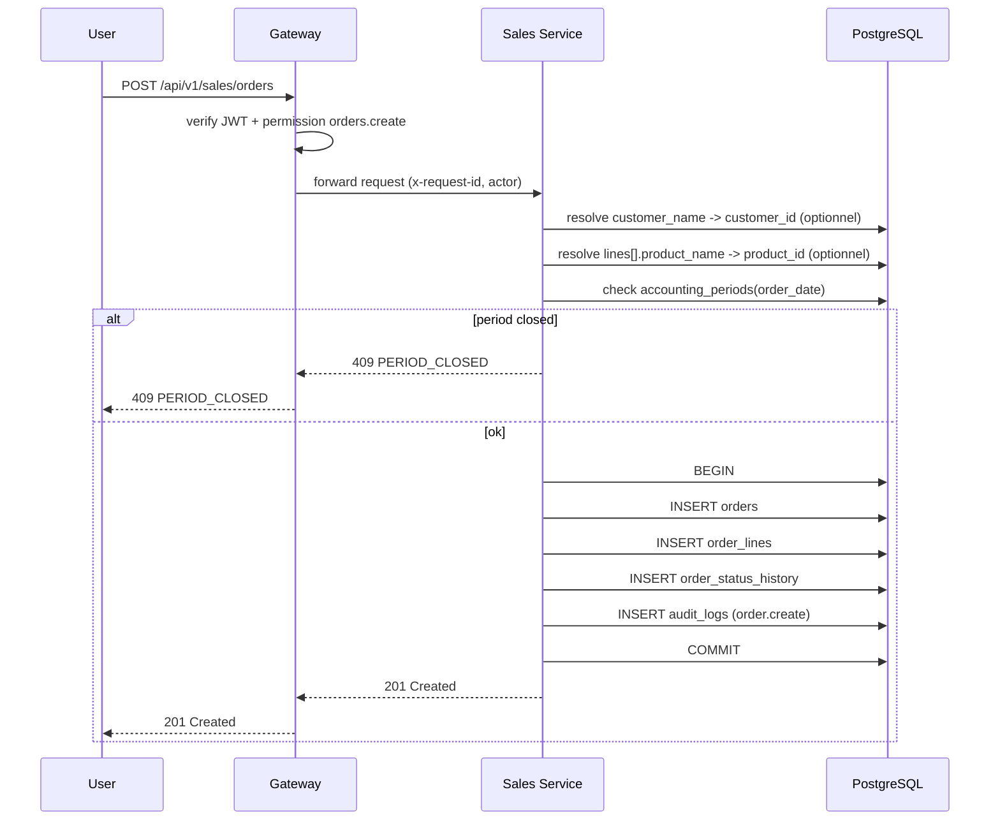

# Sequence - Create Order

```mermaid
sequenceDiagram
  participant U as User
  participant G as Gateway
  participant S as Sales Service
  participant DB as PostgreSQL

  U->>G: POST /api/v1/sales/orders
  G->>G: verify JWT + permission orders.create
  G->>S: forward request (x-request-id, actor)

  S->>DB: resolve customer_name -> customer_id (optionnel)
  S->>DB: resolve lines[].product_name -> product_id (optionnel)
  S->>DB: check accounting_periods(order_date)

  alt period closed
    S-->>G: 409 PERIOD_CLOSED
    G-->>U: 409 PERIOD_CLOSED
  else ok
    S->>DB: BEGIN
    S->>DB: INSERT orders
    S->>DB: INSERT order_lines
    S->>DB: INSERT order_status_history
    S->>DB: INSERT audit_logs (order.create)
    S->>DB: COMMIT
    S-->>G: 201 Created
    G-->>U: 201 Created
  end
```
