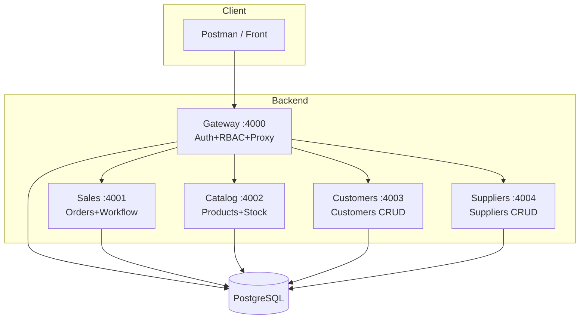

# Container View (C4 - Niveau 2)

```mermaid
flowchart TB
  subgraph Client
    Postman[Postman / Front]
  end

  subgraph Backend
    Gateway[Gateway :4000\nAuth+RBAC+Proxy]
    Sales[Sales :4001\nOrders+Workflow]
    Catalog[Catalog :4002\nProducts+Stock]
    Customers[Customers :4003\nCustomers CRUD]
    Suppliers[Suppliers :4004\nSuppliers CRUD]
  end

  DB[(PostgreSQL)]

  Postman --> Gateway
  Gateway --> Sales
  Gateway --> Catalog
  Gateway --> Customers
  Gateway --> Suppliers

  Gateway --> DB
  Sales --> DB
  Catalog --> DB
  Customers --> DB
  Suppliers --> DB
```

Notes:
- Gateway applique l'authentification JWT et les permissions.
- Les services appliquent logique métier, transactions et audit.
