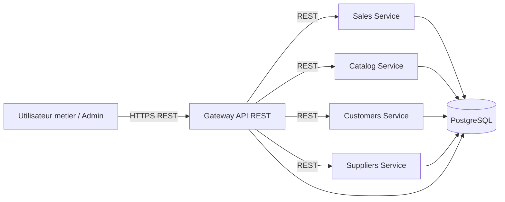

# System Context (C4 - Niveau 1)

```mermaid
flowchart LR
  User[Utilisateur metier / Admin]
  Gateway[Gateway API REST]
  Sales[Sales Service]
  Catalog[Catalog Service]
  Customers[Customers Service]
  Suppliers[Suppliers Service]
  PG[(PostgreSQL)]

  User -->|HTTPS REST| Gateway
  Gateway -->|REST| Sales
  Gateway -->|REST| Catalog
  Gateway -->|REST| Customers
  Gateway -->|REST| Suppliers

  Sales --> PG
  Catalog --> PG
  Customers --> PG
  Suppliers --> PG
  Gateway --> PG
```

Objectif: montrer le système ERP backend et ses interactions externes.
